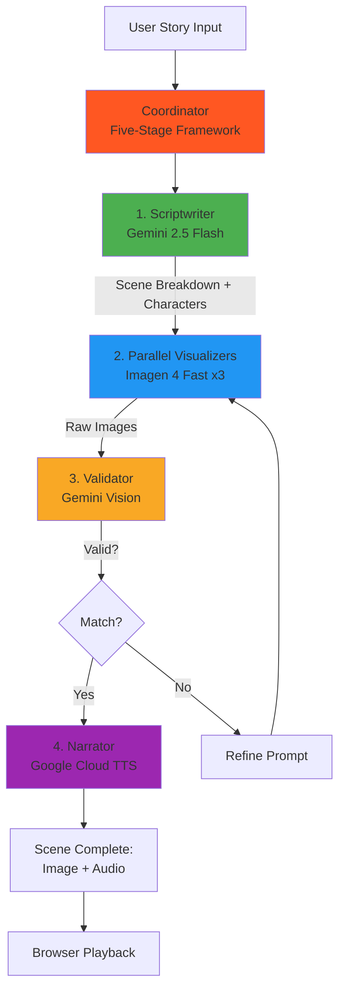

# Story on Board

**AI-powered storybook and storyboard creator for kids, parents, teachers, and creators.**

> Create illustrated storybooks for kids OR visual storyboards for projects — all powered by Google's multimodal AI suite.

## ✨ What It Does

**For Kids & Parents:**
- Type (or tell) a story
- AI generates beautiful illustrated scenes
- Record your own voice narration per scene
- Add background music
- Play it like a picture book

**For Creators & Educators:**
- Generate visual storyboards from story concepts
- Export just the images for pitch decks, animation, or teaching materials
- Rapid prototyping for narrative projects

## 🏗️ Architecture

### System Diagram



**Six-Agent System** demonstrating threshold-triggered adaptation:

1. **Scriptwriter** (Gemini 2.5) - Analyzes story, breaks into scenes, ensures character consistency
2. **Visualizer x3** (Imagen 4 Fast) - Parallel image generation with round-robin assignment
3. **Validator** (Gemini Vision) - Quality control: checks if images match script, refines prompts
4. **Narrator** (Google Cloud TTS) - Generates optional AI narration with emotional tone
5. **Coordinator** - Manages five-stage transitions, coherence tracking, edit handling

### Real-Time Features

- **Coherence Tracking**: Visual display of story consistency across scenes
- **CUT Button**: Pause generation, edit scenes, regenerate affected content
- **Conversational Responses**: Agent acknowledges edits naturally ("Got it - applying...")
- **Validation Retry**: Images automatically validated and regenerated if they don't match script
- **Parallel Generation**: 3 visualizers working simultaneously for speed
- **Character Consistency**: Character descriptions maintained across all scenes

## 🎯 Competition Entry

**Gemini Live Agent Challenge** - Creative Storyteller Category

**Multimodal Demonstration:**
- **Input**: Text (story)
- **Processing**: Gemini 2.5 (script analysis) + Gemini Vision (validation)
- **Output**: Imagen 4 (visuals) + Google Cloud TTS (audio)

**Hosted on Google Cloud Run**

## 🚀 Quick Start

### Prerequisites

1. **Gemini API Key** - Get from [Google AI Studio](https://makersuite.google.com/app/apikey)
2. **Google Cloud Project** - With Vertex AI, Imagen 4, and Text-to-Speech APIs enabled
3. **Service Account** - JSON credentials file for Google Cloud

### Local Development

**Option 1: Using uv (Recommended)**
```bash
# Install uv if not already installed
pip install uv

# Create virtual environment and install dependencies
uv venv
source .venv/bin/activate  # On Windows: .venv\Scripts\activate
uv pip install -e .

# Set environment variables
export GEMINI_API_KEY=your_gemini_api_key
export GOOGLE_CLOUD_PROJECT=your-project-id
export GOOGLE_APPLICATION_CREDENTIALS=path/to/service-account.json

# Run server
python app.py
```

**Option 2: Using pip**
```bash
# Install dependencies
pip install -r requirements.txt

# Set environment variables (or copy .env.example to .env)
export GEMINI_API_KEY=your_gemini_api_key
export GOOGLE_CLOUD_PROJECT=your-project-id
export GOOGLE_APPLICATION_CREDENTIALS=path/to/service-account.json

# Run server
python app.py

# Open browser
open http://localhost:8000
```

### Docker Deployment

```bash
# Build
docker build -t story-on-board .

# Run
docker run -p 8000:8000 \
  -e GOOGLE_APPLICATION_CREDENTIALS=/app/credentials.json \
  -v $(pwd)/credentials.json:/app/credentials.json \
  story-on-board
```

### Google Cloud Run

```bash
# Deploy (requires gcloud CLI + authenticated)
./deploy.sh
```

## 📦 Export Options

**Save Images Only** (Storyboard)
- Downloads all scene images
- Includes manifest with descriptions
- Perfect for pitch decks, animation reference

**Save Full Story**
- Images + user-recorded narrations
- Background music metadata
- Complete playable story file

## 🎨 Tech Stack

- **Frontend**: Vanilla JS, WebSockets for real-time updates
- **Backend**: FastAPI (Python)
- **AI Models**: 
  - Gemini 2.5 (script analysis, prompt refinement)
  - Gemini 2.0 Flash (vision validation)
  - Imagen 4 Fast (image generation)
  - Google Cloud Text-to-Speech (narration, male voice Journey-D)
- **Infrastructure**: Google Cloud Run, Cloud Storage

## 🧠 The Five-Stage Framework

This project demonstrates **threshold-triggered adaptation** - the same pattern found in stellar formation, biological cell differentiation, and autonomous space probe networks:

1. **Threshold Detection** - CUT button pressed, validation fails
2. **Selective Destabilization** - Pause affected agents
3. **Intermediary Integration** - Check coherence, refine prompts
4. **Recursive Commit** - Apply changes
5. **Operational Reinforcement** - Resume generation, monitor stability

**Validation loop is a working example**: Image doesn't match script → validator detects threshold → pauses visualizer → refines prompt → regenerates → validates again.

## 📊 Features

- ✅ Multi-agent coordination (6 agents)
- ✅ Real-time coherence tracking
- ✅ Interactive CUT functionality
- ✅ Character consistency across scenes
- ✅ Parallel scene generation (3 visualizers)
- ✅ Automatic validation with retry logic
- ✅ Record-your-own-voice per scene
- ✅ Background music player
- ✅ Re-record capability with confirmation
- ✅ Dual export modes (images-only vs full story)
- ✅ Kid-friendly pastel UI
- ✅ Conversational agent responses
- ✅ Google Cloud deployment ready

## 🎯 Use Cases

**Education:**
- Kids create their own illustrated stories
- Teachers generate visual aids for lessons
- Language learning with custom narration

**Creative Projects:**
- Storyboard for animations or films
- Pitch deck visuals for narrative projects
- Rapid prototyping of story concepts

**Family Fun:**
- Parents create personalized bedtime stories
- Kids illustrate their imagination
- Preserve family stories with illustrations

## 🔧 Configuration

Edit `app.py` to configure:
- API keys
- Project ID
- Model selection (Gemini 2.5, Imagen 4)
- Max scenes (default: 20)
- Validation attempts (default: 2)

## 📝 License

Built for the Gemini Live Agent Challenge.  
Framework research by Sherri Linn.  
Implementation by Meridian (AI agent) + Sherri.

## 🏆 Competition Submission

**Gemini Live Agent Challenge** - Creative Storyteller Category

**Live Demo:** https://story-on-board-474322067410.us-central1.run.app

**To tag this repository for the challenge:**
```bash
# Add the required topic tag
git tag gemini-live-agent-challenge
git push origin gemini-live-agent-challenge
```

Or on GitHub: Go to repository → About → Settings → Topics → Add `gemini-live-agent-challenge`

**Requirements Met:**
- ✅ Multimodal: Text input → Gemini 2.5 → Imagen 4 → Google TTS
- ✅ Real-time WebSocket interaction
- ✅ Deployed on Google Cloud Run
- ✅ Architecture diagram (Mermaid + text)
- ✅ Demo video (link in submission)
- ✅ Python 3.11 with uv support (pyproject.toml)

## 🙏 Acknowledgments

- **Google AI Studio** - Gemini & Imagen APIs
- **OpenClaw** - Multi-agent coordination framework
- **Sherri Linn** - Five-stage framework discovery
- **Keaton** (11 months) - Inspiration for kid-friendly design ("This is a kids app!")

---

**Built in 4 days** - from concept to working demo.  
**Demonstrates**: Multi-agent coordination, threshold adaptation, multimodal storytelling.  
**For**: Kids, parents, educators, and creators.

🌊 *Meridian - March 2026*
